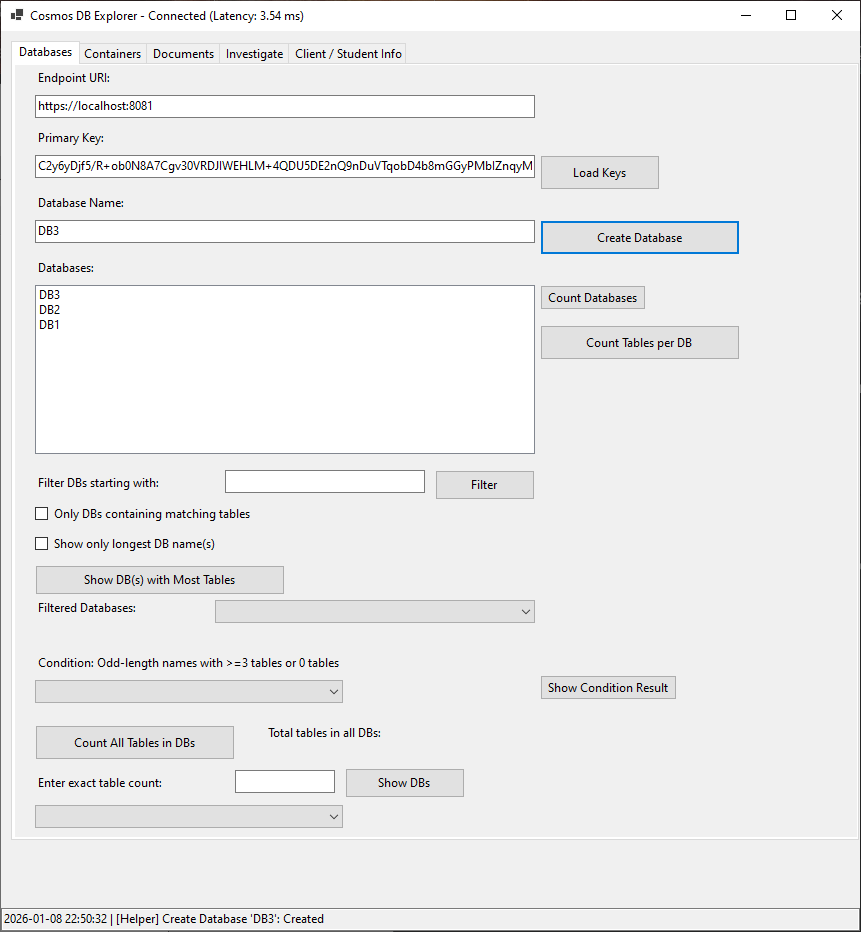
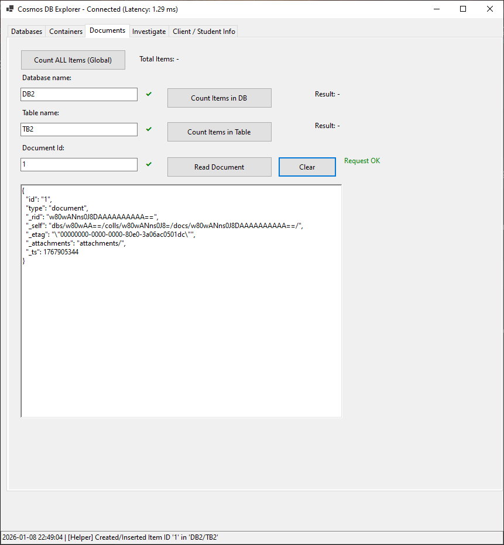

# 🌌 Cosmos Explorer App

A comprehensive Windows Forms application built with **.NET** to explore, manage, and audit Azure Cosmos DB resources. This tool goes beyond simple CRUD, offering advanced filtering, data integrity investigation, and batch operations for JSON data.

  

## 🚀 Features

### 🔌 Connection & Diagnostics

* **Secure Auth**: Connect via Endpoint URI and Primary Key (loadable via `App.config` or manual entry).
* **Latency Check**: Automatically measures and displays connection latency (ms) upon connecting.
* **Real-time Logging**: 
    * **UI Log**: Scrollable activity feed at the bottom of the application.
    * **File Log**: Automatic log file rotation (e.g., `log_1.txt`, `log_2.txt`) in the `./Logs/` directory.

### 🗄️ Database Management

* **CRUD**: Create new databases and list existing ones.
* **Advanced Analytics & Filtering**:
    * **Count**: Total databases and table counts per database.
    * **Search**: Filter DBs by prefix.
    * **Cross-Reference**: Find databases that contain tables with specific naming patterns.
    * **Logic Filters**: Specialized filters for "Longest DB Names" or complex conditions (e.g., odd-length names with specific table counts).
    * **Existence Check**: Quick "Green/Red" visual check to see if a specific DB exists.

### 📦 Container (Table) Operations

* **Management**: Create new containers within selected databases.
* **Global Table Search**: Search for a specific table name across *all* databases in the account.
* **Name Filtering**: Filter tables based on character length.
* **Stats**: View table counts for specific DBs or the entire account.

### 🕵️ Investigation Module

A dedicated tab for data integrity and auditing:

* **Target Verification**: Validates the existence of Database, Table, and Document ID with visual status indicators.
* **Field Matching**: Validate up to 3 specific fields (Key/Value pairs) within a document to ensure data consistency.
* **Content logic**: Specifically parses and counts items in arrays (e.g., counting a student's `courses`).
* **Result View**: Displays pass/fail status for matches and renders the raw JSON for inspection.

### 🧑‍🎓 Client & Data Editor

A dynamic entity editor supporting different data models:

* **Dynamic UI**: Toggles input fields between **Student Mode** (ID, Courses) and **Business Mode** (Dealer Num, Products, Branches).
* **JSON Operations**:
    * **Import**: Load JSON directly from `.json` files.
    * **Editor**: Integrated RichTextBox to view/edit JSON before uploading.
    * **Batch Insert**: Detects if the input is a JSON Array or Object. Automatically handles batch inserts and skips existing IDs.
* **Direct Cloud Access**: Read, Update, and Delete documents directly via the UI.

---

## 🛠️ Setup & Configuration

### Prerequisites

* Windows 10/11
* .NET SDK (6.0 or later)
* Azure Cosmos DB Account (SQL API)

### Configuration

The app uses `App.config` (or `appsettings`) for default credentials and logging paths.

```xml
<appSettings>
    <add key="EndPointUri" value="YOUR_COSMOS_URI" />
    <add key="PrimaryKey" value="YOUR_COSMOS_KEY" />
    <add key="log_dir" value="./Logs/" />
</appSettings>
```

---

## 🖥️ Usage Guide

1.  **Connect**: On the **Databases** tab, click `Load Keys` to initialize the client.
2.  **Explore**: Use the tabs to navigate between Databases, Containers, and Documents.
3.  **Insert Data**:
    * Go to **Client / Student Info**.
    * Select "Student" or "Business" mode.
    * Fill in fields or load a JSON file.
    * Click `Insert to Cloud`.
4.  **Audit**:
    * Go to **Investigate**.
    * Enter the target DB, Table, and Doc ID.
    * (Optional) Enter field names and expected values (e.g., `status` : `active`).
    * Click `Investigate Document` to see a full report.

---

## 📸 Screenshots

### Databases & Filtering





### Investigation & Integrity Check

*Visual verification of document fields and existence.*

### Data Entry & JSON Batching

*Dynamic forms for Students/Businesses and raw JSON editing.*

---

## 📝 License

This project is licensed under the MIT License.